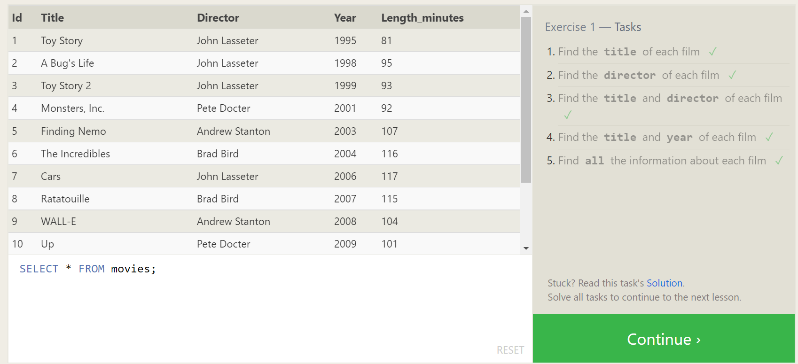
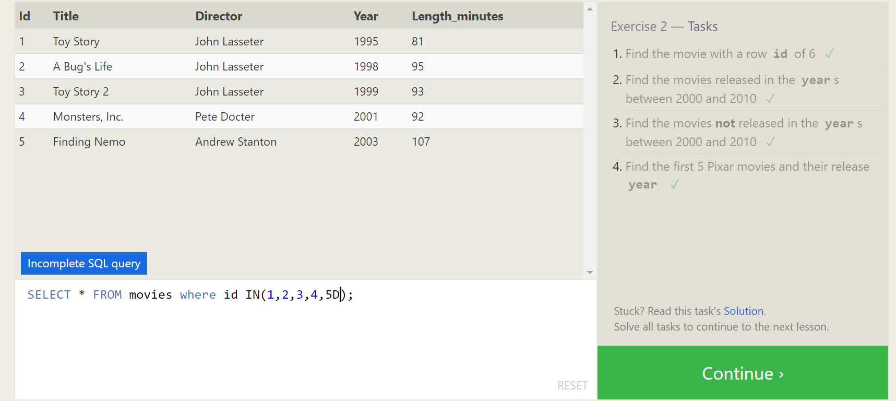
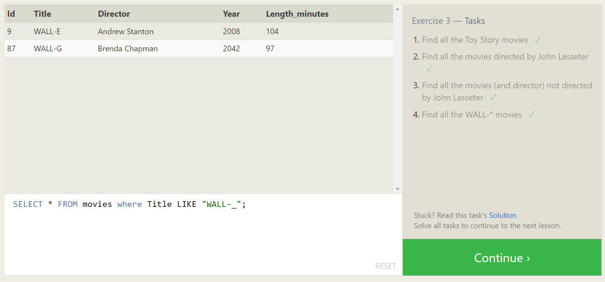
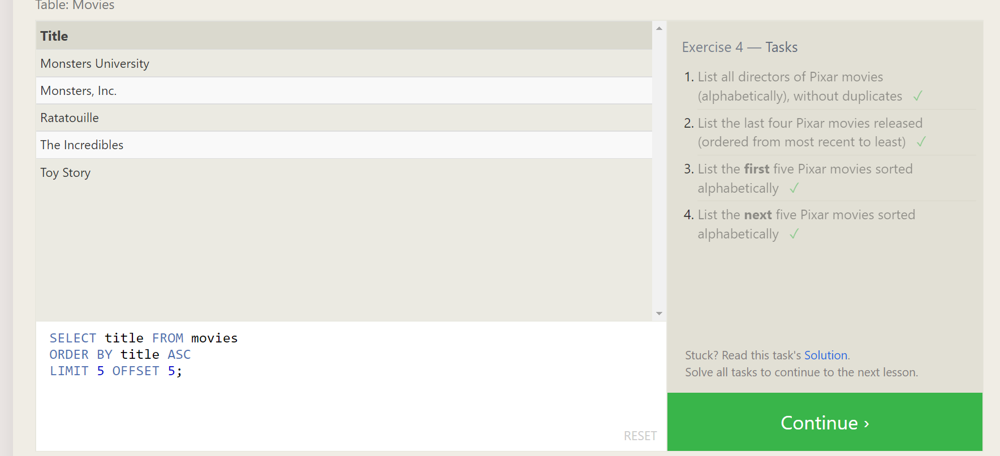
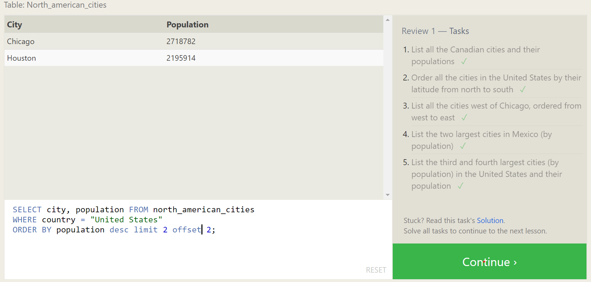
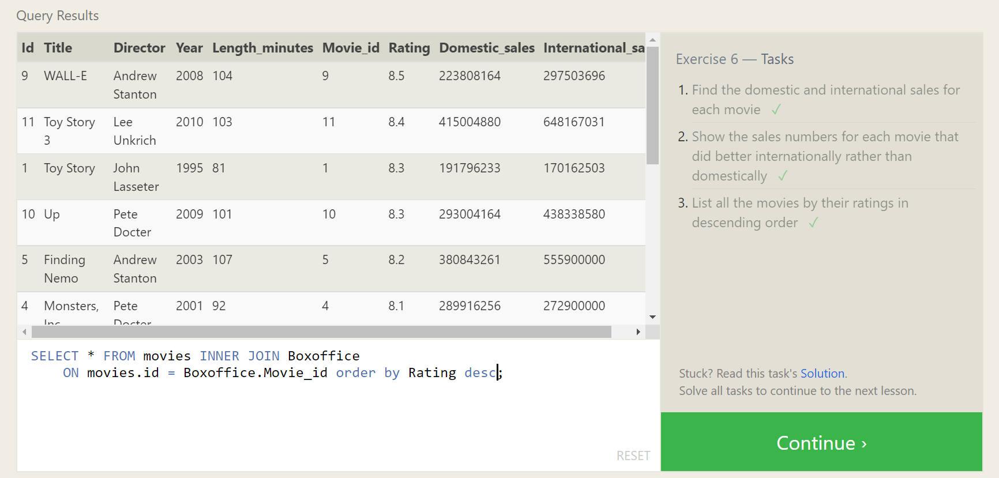
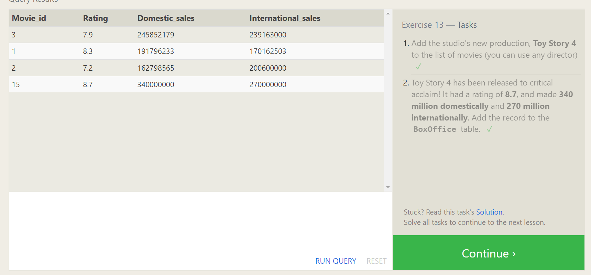

# SQL Practice
I learned about those concepts
1. SELECT: which is used to select data from a database. The data returned is stored in a result table, called the result-set.
2. WHERE: which is used to filter records. It is used to extract only those records that fulfill a specified condition.
3. SELECT DISTINCT is used to return only different values from a table in the database.
4. GROUP BY groups rows that have the same values into summary rows
5. ORDER BY: is used to sort the result-set in ascending or descending order.
6. INNER JOIN: we use it if we have two tables and it is used to select records that have matching values in both tables.
7. INSERT: declares which table to write into and it worked with VALUES(Value1, Value2, ...)

## HERE is THE Exercises ordered ASC
### Exercise 1

### Exercise 2

### Exercise 3

### Exercise 4

### Exercise 5

### Exercise 6

### Exercise 13

